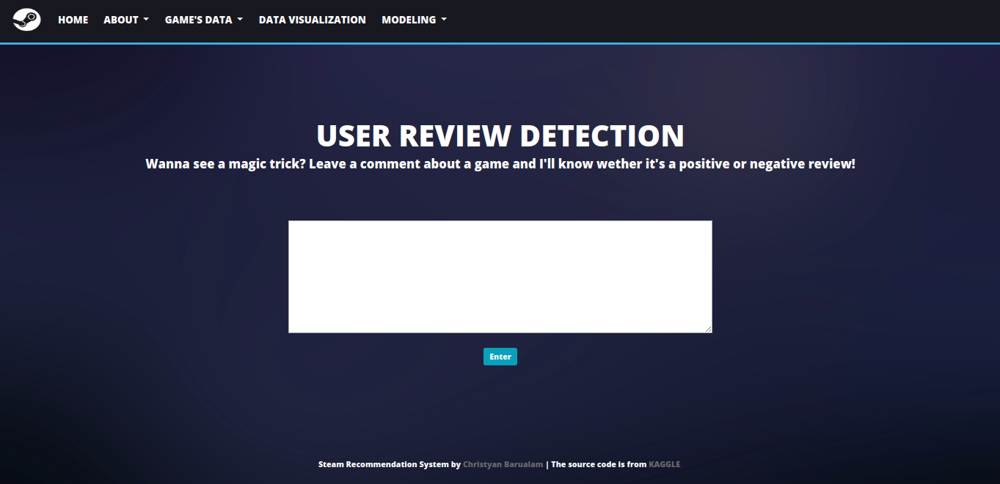
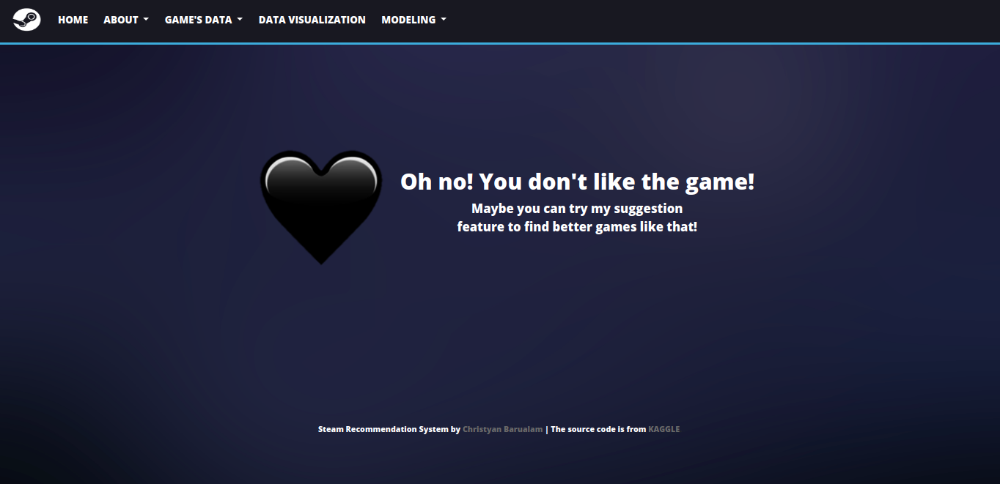
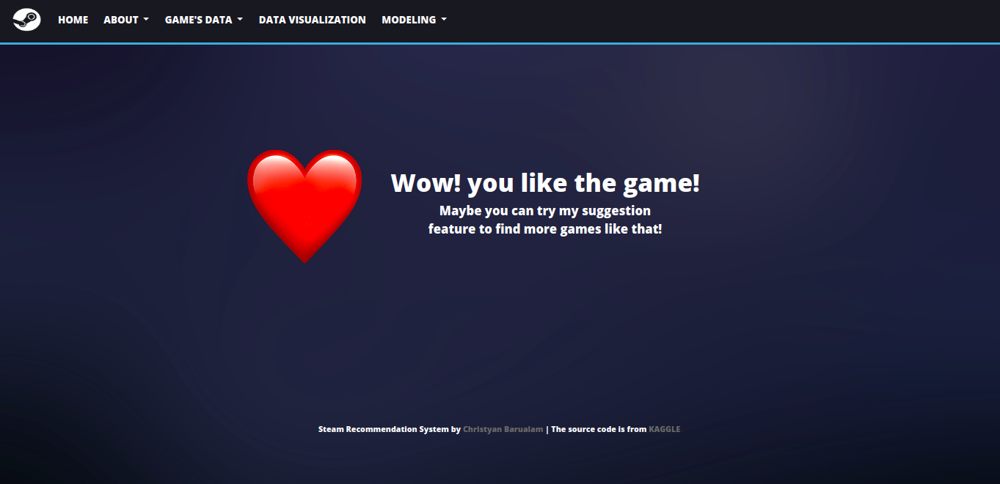

# Final-Project-JCDSBDG02 (Steam Game)
As the years go by, the growth in the gaming industry is getting bigger. 
The number of games developed and being developed is just way too much, it’s out of control. 
This gives users and the industry some difficulties. It gives gamers a difficulty to choose which games they can play. 
Instead of playing right away, gamers will have to search for a game from a variety of lists. 
To find the perfect game, gamers have to spend a lot of time. 
While for the game developers, 
it gives them difficulties as they might be developing games that users dislike and it could be really bad for them. 
This is a large problem for gamers and their industry. To overcome this problem, I’ve created two solutions:

# A. Detecting Steam Reviews with NLP
The first one is a user-review detection in which, the feedback of a user will either be detected as positive 
or negative feedback. I was able to create this by using Natural Language Processing (NLP). 
I’ve deployed a model to detect which feed is positive or negative. 
This system will be a big help to the game developers as it will allow them to create better 
game ideas since they know the likes and dislikes of the users. 

## 1 About Data
The dataset is obtained from kaggle <a href="https://www.kaggle.com/whoiskk/steam-game-reviews">https://www.kaggle.com/whoiskk/steam-game-reviews/</a>, which contains around 17000 reviews from 44 different game titles
The data included features like :
- Title 
- Year 
- User Review 
- User Suggestion

## 2. Data Cleaning
Before doing the count vectorizer, it needed to do some data cleaning process such as:
- Remove all non english reviews
- Remove all 'Early Access Review' sentence
- Remove punctuation 
- Word and Number Splitting (I am4 -> I am 4)
- Fix every camelcase(camelCase -> camel Case)
- Remove all the whitespace
- Remove all unecesarry symbol
- Remove stopwords
- Remove every ('game', 'play', 'player', 'players', 'people', 'games', 'playing') words 

| Before Cleaning   | After Cleaning         | 
| ------------- |:-------------:| 
| *'It\'s not a bad game, it\'s just waaaay too slow for me. You practically do NOTHING for the first 500 rooms and then the "scary" moments aren\'t scary enough to be worth the boredom of the first 500 rooms :/'*      | *'bad waaaay slow practically NOTHING first 500 rooms scary moments arent scary enough worth boredom first 500 rooms'* | 
|*"Great game, fun and colorful and all that.A side note, though: When are we getting windowed mode? My computer hates fullscreen so.... yeah. The computer doesn't like to run this. Shame, because this is really enjoyable. But until then, I guess I'll settle for more Skyrim. Cheers!"*|*'Great fun colorful thatA side note though getting windowed mode computer hates fullscreen yeah computer doesnt like run Shame really enjoyable guess Ill settle Skyrim Cheers'*|

## 3. Data Pre-Processng
Pre-processing involved transforming the clean reviews into numberical data. I used count vectorization and TF-IDF 
vectorizer

## 4. Modeling (Classification)
The classification problem involved predicting whether a user is giving positive or negative review. I tried some algorithm such as:
- Logistic Regression
- Multinomial Naive Bayes
- Decision Tree
- Random Forest Classifier
- K Neighbors Classifier

Which gave me the followings results for 5 fold CV:
|        Model        | Crossval Score    | Train Accuracy | Test Accuracy |
| ------------------- | ----------------- | ---------------|--------------:|
| Logistic Regression | 0.790 | 0.916 | 0.859 |
| Multinomial NB      | 0.698 | 0.841| 0.770 |
| Decision Tree       | 0.652 | 0.999 | 0.685 |
| Random Forest       | 0.768 | 0.999| 0.829 |
| K Neighbour         | 0.621 | 0.838| 0.769 |

From all of this model i choosed Logistic Regression as the best model consider it has the highest crossval and test accurcy score

## 5. Hyper Parameter Optimization
To increase the accuracy of my modeling efforts, i decided to choose 3 best model and do some experiment with it. 
I experimented wiht Logistic Regression, Multinomial NB and Random Forest classification.
### Logisitic Regression
For Logistic Regression, I grid searched through :
- *penalty = [l1, l2]*
- *C = np.logspace(-4,4,20)*

And found the best parameters are penalty = 'l2' and C = 4.281 to achieve the following scores :
| Model | Accuray | Precison | Recall | F1 |
| ----- | ------- | ---------| -------| ---|
| Logistic Regression | 0.86 | 0.87 | 0.89 | 0.88 |

### Multinomial Naive Bayes
For this model, I grid searched through : 
- *alpha = np.linspace(0.5, 1.5, 6)*
- *fit_prior = [True, False]*

And found the best parameters are alpha = 1.5 and fit_prior = False to achieve the following scores:
| Model | Accuray | Precison | Recall | F1 |
| ----- | ------- | ---------| -------| ---|
| Multinomial NB | 0.84 | 0.86 | 0.86 | 0.86 |

### Random Forest
For this model, I grid searched through :
- n estimator = [100,200,300]
- min samples split = [8,10,12]
- min samples leaf = [3,4,5]

And found the best parameter are n estimator = 300, min sample split = 8, min sample leaf = 3 to achieve the folliwng scores:
| Model | Accuray | Precison | Recall | F1 |
| ----- | ------- | ---------| -------| ---|
| Random Forest | 0.83 | 0.80 | 0.93 | 0.86 |

## 6. Dashboard

> User put the review here

> Output if the review is negative

> Output if the review is positive

